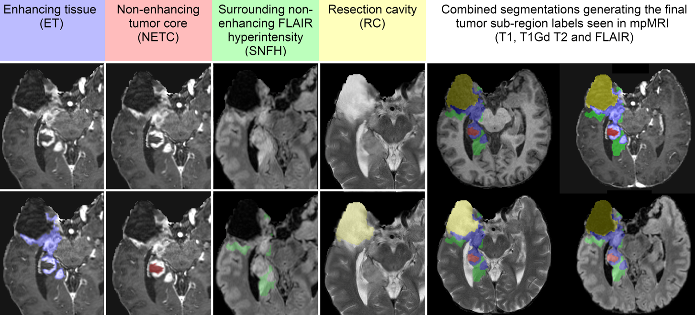

# 🧠 3D Auto-Segmentation of Post-Treatment Gliomas on mpMRI (BraTS 2024)

[](https://www.med.upenn.edu/cbica/brats2024/data.html)
[](https://www.python.org/)
[]()

> 3D Vision Winter School 2025 – Individual Project

---

## 📚 Table of Contents

- [📌 Project Overview](#-project-overview)
- [🗂️ Dataset](#️-dataset)
- [🛠️ Features](#️-features)
- [🏗️ Project Structure](#-project-structure)
- [🚀 Getting Started](#-getting-started)
- [📊 Results](#-results)
- [📈 Visualizations](#-visualizations)
- [🔮 Future Work](#-future-work)
- [🧑‍💻 Author](#-author)
- [📄 License](#-license)

---

## 📌 Project Overview

This project focuses on **automatic 3D segmentation of post-treatment gliomas** using multiparametric MRI (mpMRI) from the **BraTS 2024 dataset**. The goal is to segment clinically relevant tumor sub-regions:

- 🔴 Non-enhancing tumor core (NETC)
- 🟢 Surrounding non-enhancing FLAIR hyperintensity (SNFH)
- 🔵 Enhancing tissue (ET)
- 🟡 Resection cavity (RC)

  
  

Developed as part of my individual project at the 3D Vision Winter School 2025, this repository includes preprocessing, training, inference, evaluation, and visualization modules.

---

## 🗂️ Dataset

The project uses data from the **BraTS 2024 Adult Glioma Post-Treatment Challenge**. Each subject contains:

- 4 mpMRI sequences: `t1n`, `t1c`, `t2w`, `t2f`
  
  
  
  
  
- 1 segmentation label map (`seg.nii.gz`)
  
  
  
Label mapping:
- 0 = Background
- 1 = Non-enhancing Tumor Core (NETC)
- 2 = SNFH
- 3 = Enhancing Tumor (ET)
- 4 = Resection Cavity (RC)

> 🔒 Validation labels were not provided due to challenge policy. Inference results were evaluated qualitatively or via comparison to BraTS 2024 baseline algorithms (provided).

---

## 🛠️ Features

✅ Modular structure (exploration → preprocessing → training → evaluation)  
✅ Patch-wise 3D U-Net for memory-efficient segmentation  
✅ Supports 5-fold cross-validation  
✅ Lesion-wise Dice Score & Hausdorff 95 computation  
✅ 3D Slicer-compatible output for visualization  
✅ Inference comparison with BraTS 2024 baseline model

---

## 🏗️ Project Structure

---

## 🚀 Getting Started

### 1. Clone this repo

```bash
git clone https://github.com/eugene-kim806/3DVWS_2025.git
```

---

## 📊 Results

---

## 📈 Visualizations

---

## 🔮 Future Work

---

## 🧑‍💻 Author

**\[Eugene Kim]**

Winter School on 3D Vision 2025

📧 \[[eugekim.Kim@ghent.ac.kr](mailto:eugekim.Kim@ghent.ac.kr)]

🔗 \[www.linkedin.com/in/eugene-kim-bb7544304]

🐙 \[github.com/eugene-kim806]

---

## 📄 License

This project is for academic use only. Please refer to the BraTS License Agreement for dataset usage.
